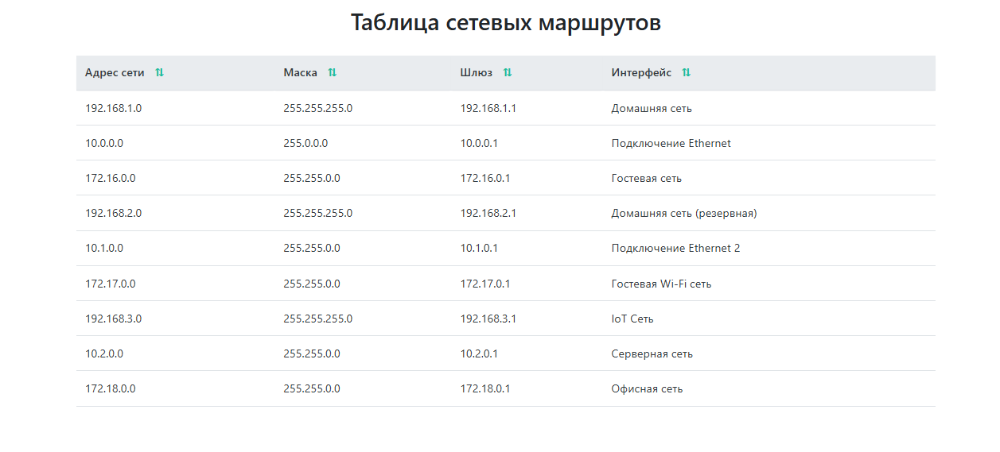

# Таблица маршрутов с сортировкой



Проект реализует таблицу для отображения и сортировки списка сетевых маршрутов.

## Функциональность

✅ **Отображение таблицы маршрутов**
- Вывод полей: `Адрес назначения`, `Маска подсети`, `Шлюз`, `Интерфейс`
- Загрузка данных с имитацией задержки (1 секунда)

✅ **Сортировка данных**
- Поддержка сортировки по всем столбцам кроме UUID
- Особенности сортировки:
  - Для IP-адресов (`address`, `mask`, `gateway`) - числовое сравнение
  - Для интерфейсов (`interface`) - строковое сравнение
- Индикация направления сортировки (↑/↓)

✅ **Состояния загрузки**
- Индикатор загрузки при получении данных
- Обработка ошибок загрузки

   

## Техническая реализация

### Используемый стек
- Angular 18+
- TypeScript
- RxJS (Observables, BehaviorSubject)

### Структура данных
```typescript
interface Route {
  uuid: string;          // Уникальный идентификатор
  address: string;       // IP-адрес сети назначения (напр. "192.168.1.0")
  mask: string;          // Маска подсети (напр. "255.255.255.0")
  gateway: string;       // IP-адрес шлюза (напр. "192.168.1.1")
  interface: string;     // Имя сетевого интерфейса
}

type RouteSortColumn = keyof Omit<Route, 'uuid'>;  // Доступные для сортировки столбцы
type SortDirection = 'asc' | 'desc';               // Направление сортировки
```

## Архитектура проекта

```text
src/
├── app/
│   ├── routes-table/ 			   # Компонент таблицы           
│   ├── models/
│   │   └── route.model.ts         # Типы данных
│   ├── services/
│   │   └── route.service.ts       # Логика работы с данными
│   └── mocks/
│       └── routes.mock.ts         # Тестовые данные
```

## Установка и запуск

1. Установите зависимости:

```bash
npm install
```

2. Запустите приложение:

```bash
ng servel
```

3. Откройте в браузере:
```bash
http://localhost:4200
```

## Планы по развитию

🔹 Реализация на Signals (отдельная ветка) \
🔹 Пагинация данных \
🔹 Написание unit-тестов